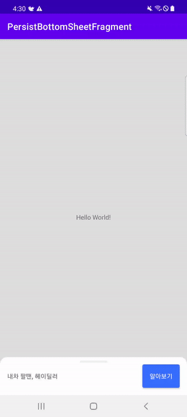

 
# What is PersistBottomSheetFragment?
- When you use the BottomSheetFragment, sometime you need persistent BottomSheetFragment
- Ex) Google Map's bottom UI
- `PersistBottomSheetFragment` is a BottomSheetFragment that is made to be very easy to implement.
- You only need to implement it with the UI when collapse and expanded


|       Google Map        |    Hey Dealer    |          Sample           |
| :-----------------------: | :----------------: | :-------------------------: |
|  |  |  |

           
## Setup


### Gradle
[](https://search.maven.org/search?q=g:%22kr.co.prnd%22%20AND%20a:%persistBottomSheetFragment%22)
```gradle
repositories {
    google()
    mavenCentral()
}

dependencies {
    implementation 'kr.co.prnd:persistBottomSheetFragment:x.y.z'
    //implementation 'kr.co.prnd:persistBottomSheetFragment:1.0.0'
}

```

If you think this library is useful, please press star button at upside. 
<br/>

<br/><br/>


## How to use
### 1.Enable databinding
- `PersistBottomSheetFragment`use databinding
- Set enable databinding in your app `build.gradle`
```gradle
buildFeatures {
    dataBinding = true
}
```

### 2. Collase/Expand UI
- Make layout resource file for collapse/expand
- ex) `layout_collapse.xml`, `layout_expand.xml`


### 3. Make your PersisBottomSheetFragment
- Extend `PersistBottomSheetFragment` and use collapse/expand layout resource
```kotlin
class SamplePersistBottomFragment :
    PersistBottomSheetFragment<LayoutCollapseBinding, LayoutExpandBinding>(
        R.layout.layout_collapse,
        R.layout.layout_expand
    ) {
      //...
 }
```

- example
```kotlin
class SamplePersistBottomFragment :
    PersistBottomSheetFragment<LayoutCollapseBinding, LayoutExpandBinding>(
        R.layout.layout_collapse,
        R.layout.layout_expand
    ) {
    override fun onViewCreated(view: View, savedInstanceState: Bundle?) {
        super.onViewCreated(view, savedInstanceState)
        collapseBinding.viewSelect.setOnClickListener {
            expand()
        }
    }
    companion object {
        private val TAG = SamplePersistBottomFragment::class.simpleName
        fun show(
            fragmentManager: FragmentManager,
            @IdRes containerViewId: Int,
        ): SamplePersistBottomFragment =
            fragmentManager.findFragmentByTag(TAG) as? SamplePersistBottomFragment
                ?: SamplePersistBottomFragment().apply {
                    fragmentManager.beginTransaction()
                        .replace(containerViewId, this, TAG)
                        .commitAllowingStateLoss()
                }
    }
}

```


## FAQ
### - I want access collapse/expand ui
- You can anytime access collapse/expand ui using `collapseBinding`, `expandBinding`
```kotlin
collapseBinding.viewSelect.setOnClickListener {
    // ..
}
```
### - I want cusomize BottomSheetBehavior
- you can use `bottomSheetBehavior` variable

### - I want handle back key event
- `handleBackKeyEvent()` support back key event
```kotlin
 override fun onBackPressed() {
     if (samplePersistBottomFragment?.handleBackKeyEvent() == true) {
         // no-op
     } else {
         super.onBackPressed()
     }
 }
```

## License 
 ```code
Copyright 2021 PRNDcompany

Licensed under the Apache License, Version 2.0 (the "License");
you may not use this file except in compliance with the License.
You may obtain a copy of the License at

http://www.apache.org/licenses/LICENSE-2.0

Unless required by applicable law or agreed to in writing, software
distributed under the License is distributed on an "AS IS" BASIS,
WITHOUT WARRANTIES OR CONDITIONS OF ANY KIND, either express or implied.
See the License for the specific language governing permissions and
limitations under the License.
```
